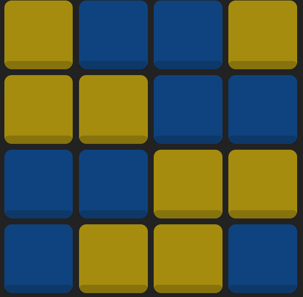
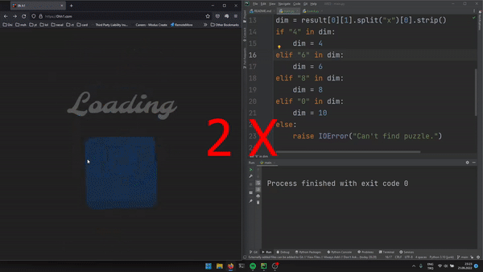

# ARES
ARES (niAei binaRy puzzlE Solver) is a binary puzzle solver. see: https://en.wikipedia.org/wiki/Takuzu

This solver promises to work on all puzzle available in [0hh1](https://0hh1.com/).

## How it works
The code can solve any given binary puzzle if the given startup has only one solution. So it does not use backtracking...

The code gets a puzzle and tries to solve it.

```python

from ares import Board

the_board = Board(4)

the_board.set(0, 0, 0)
the_board.set(0, 2, 1)
the_board.set(1, 0, 0)
the_board.set(1, 1, 0)
the_board.set(2, 3, 0)

the_board.solve()
print(the_board)

```

Result:
```
[[0. 1. 1. 0.]
 [0. 0. 1. 1.]
 [1. 1. 0. 0.]
 [1. 0. 0. 1.]]
```

The given puzzle:


The solved puzzle:


One can use OCR, and image processing to obtain the data from screen and solve the puzzle on 0hh1. With ARES one can 
make the PC click on screen too.

```python
from ares import Board
import pyautogui
import numpy as np
import easyocr

# Where on screen the puzzle is
puzzle_x_osset = 180
puzzle_y_osset = 273

# Read dimensions from screen
dim_x_osset = 184
dim_y_osset = 153

# Get screenshot
myScreenshot = pyautogui.screenshot()

# crop the image from screen
puzzle = np.array(myScreenshot)[puzzle_y_osset:600+puzzle_y_osset, puzzle_x_osset:600+puzzle_x_osset, :]
# crop dimention from screen
number = np.array(myScreenshot)[dim_y_osset:102+dim_y_osset, dim_x_osset:598+dim_x_osset, :]

# Start an OCR
reader = easyocr.Reader(['en'])
result = reader.readtext(number)
dim = result[0][1].split("x")[0].strip()

# Detect Dimension
if "4" in dim:
    dim = 4
elif "6" in dim:
    dim = 6
elif "8" in dim:
    dim = 8
elif "0" in dim:
    dim = 10
else:
    raise IOError("Can't find puzzle.")


# Create a puzzle with the image
the_board = Board.read_from_image(dim, puzzle)
# Solve the puzzle
the_board.solve()
# Click on screen
Board.click(the_board, puzzle.shape[0], puzzle_y_osset, puzzle_x_osset)


```



## Requirements

- `easyocr==1.6.2`
- `numpy==1.23.1`
- `pyautogui==0.9.53`

## How to install

### Obtain the code

```Bash
git clone https://github.com/mshemuni/ARES.git

cd ARES
```
### Install requirements

```Bash
pip install easyocr==1.6.2 numpy==1.23.1 pyautogui==0.9.53
```

or

```Bash
pip install -r requirements.txt
```

## Author
Mohammad S.Niaei

m.shemuni@gmail.com
